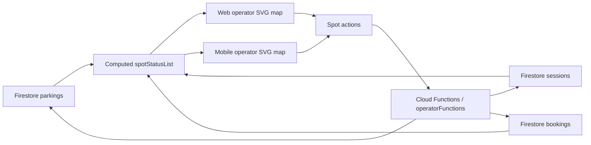

# 2D Visual Parking Map System

This document explains how the current 2D parking map works in the operator dashboard.

The 2D system is a visual control layer, not the source of truth. It reads live parking data from Firestore, converts that data into spot states, and lets operators tap or click an individual spot to run the correct parking action.

---

## 1. What The 2D System Does

The 2D map gives operators a fast visual view of one parking lot at a time.

It helps them:

- see which spots are available, reserved, or occupied,
- open a spot-level action panel,
- check in drivers manually,
- approve reserved arrivals quickly,
- process exit checkouts,
- and verify the parking flow without leaving the dashboard.

The map exists in the operator screen for both the web app and the mobile app.

---

## 2. Data Sources

The 2D view is built from live Firestore listeners and the selected parking lot.

The main inputs are:

- `selectedParkingId`: the currently active parking lot,
- `parkings`: the list of parking lots assigned to the operator,
- `activeSessions`: all active sessions for the selected lot,
- `reservedBookings`: all reserved bookings for the selected lot.

The map is recalculated every time one of those sources changes.

### Source of truth

The map does not store a separate layout database. Instead, it derives the visual state from the operational collections.

---

## 3. How Spots Are Computed

The spot list is generated from the selected parking lot capacity.

For each spot, the code builds a spot ID such as `A1`, `A2`, `B1`, and so on.

The status of each spot is determined in this order:

1. If there is an active session with a matching `spotId`, the spot is marked `occupied`.
2. Else, if there is a reserved booking with a matching `spotId`, the spot is marked `reserved`.
3. Otherwise, the spot is marked `available`.

Each spot also carries metadata such as:

- plate number,
- reservation code,
- driver ID,
- and entry time when applicable.

### Status meaning

- `available`: empty and ready for a new check-in,
- `reserved`: held for a driver with a booking,
- `occupied`: currently in use by an active session.

---

## 4. How The Map Is Drawn

The operator dashboard renders the parking lot as an SVG scene.

The visual scene includes:

- a road lane down the middle,
- entrance and exit gate markers,
- individual spot boxes,
- spot labels,
- and status icons for each state.

The layout is based on spot coordinates, not drag-and-drop positioning.

The spot positions are calculated from the spot number and row letter. In the current implementation:

- top rows use letters such as `A`, `C`, and `E`,
- bottom rows use letters such as `B`, `D`, and `F`,
- spots are spaced horizontally using a fixed offset,
- and the map is placed inside a horizontally scrollable container.

This keeps the map lightweight and predictable while still showing a clear parking pattern.

---

## 5. How Interaction Works

The map is interactive, but the interaction layer is different on web and mobile.

### Web app

The web app attaches click handlers directly to each SVG spot.

When a spot is clicked:

- the selected spot is stored in state,
- a dialog opens,
- and the operator can see the available actions for that spot.

### Mobile app

The mobile app uses invisible touch targets placed over the SVG map.

This is important because native SVG elements should stay visual while the overlay handles taps reliably.

On mobile:

- the SVG itself is treated as display only,
- each spot has a transparent `TouchableOpacity` overlay,
- and tapping the overlay opens a modal with spot actions.

This gives the same operational behavior as the web app while staying reliable on Android and iOS.

---

## 6. What Happens When A Spot Is Tapped

Once a spot is selected, the operator sees a spot operations panel.

The actions depend on the current status:

### Available spot

If the spot is available, the operator can:

- enter a plate number,
- optionally add a reservation code,
- and start a walk-in check-in.

This sends the request through the parking check-in function with walk-in mode enabled.

### Reserved spot

If the spot is reserved, the operator can:

- review the reservation details,
- and approve the driver’s arrival quickly.

This uses the reservation plate and code already stored for that spot.

### Occupied spot

If the spot is occupied, the operator can:

- review the vehicle plate,
- see the estimated parking charge,
- and choose a checkout method.

The checkout method is usually one of:

- cash,
- or driver wallet.

---

## 7. Backend Actions Triggered By The Map

The map itself does not write business data directly.

It triggers the same operator functions used elsewhere in the dashboard:

- check-in vehicle,
- check-out vehicle,
- approve check-in request,
- reject check-in request,
- confirm manual payment,
- reject manual payment.

That means the 2D map is only a visual entry point into the same workflow logic that powers the rest of the operator dashboard.

---

## 8. Operator Feedback

After a successful action, the UI gives immediate feedback.

The main signals are:

- a success alert,
- a gate-unlocked banner,
- and updated live data on the next Firestore snapshot.

This makes the 2D map feel operational instead of decorative.

---

## 9. Why The 2D Map Matters

The 2D map reduces operator friction.

Instead of searching through lists only, staff can:

- identify a specific bay visually,
- inspect its status immediately,
- and act on the exact spot that needs attention.

That improves speed during:

- manual walk-ins,
- reservation approval,
- exit processing,
- and spot-by-spot lot supervision.

---

## 10. Short Version

The 2D system works like this:

1. Load the selected parking lot.
2. Read active sessions and reserved bookings from Firestore.
3. Compute each spot’s state.
4. Render the parking map.
5. Tap or click a spot.
6. Open spot actions.
7. Run the appropriate check-in or checkout function.
8. Refresh the live dashboard state.

That is the full loop behind the operator 2D map.