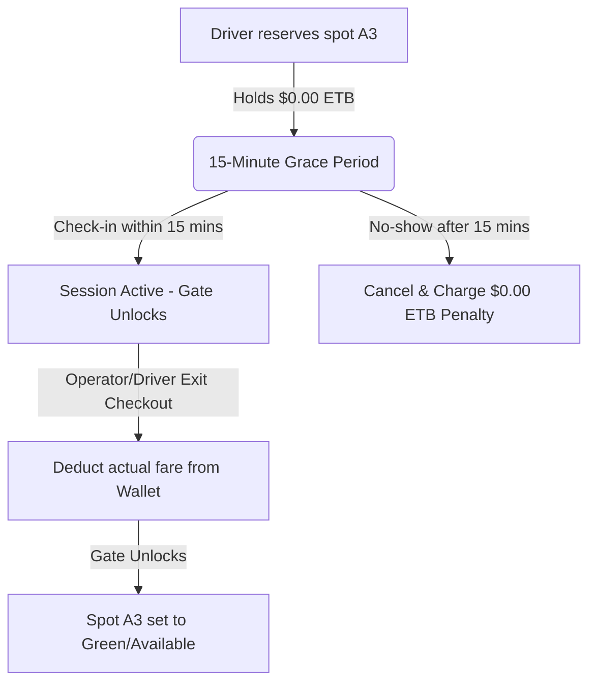
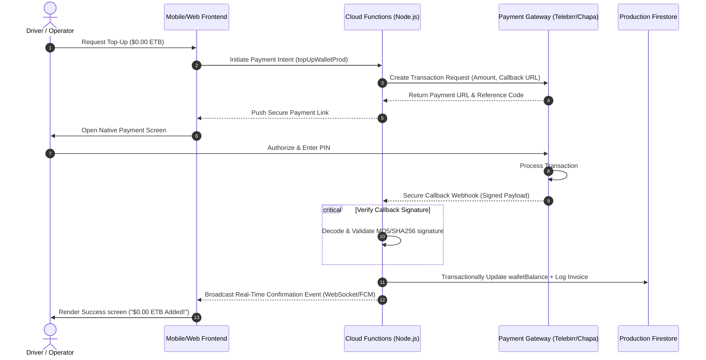

# Smart Car Parking Management System: Investor & Features Explainer Guide

Welcome to the future of urban mobility and automated parking management. This guide is designed for investors, developers, and partners to understand the technical innovations, user experience flows, and scalable architecture of our Smart Car Parking Management System. 

> [!IMPORTANT]
> **Core Architectural Philosophy: Strictly Cashless & 100% Text-Based**
> To keep operational costs low, eliminate heavy graphics processing, and support low-bandwidth cellular environments, our platform **explicitly excludes all 2D graphical maps, 2D coordinate layouts, vector pathfinding, and visual spot selectors**. All spatial tracking is managed via lightweight text database records, and all user navigation is driven by direct, step-by-step text instructions.

---

## 1. Executive Summary & Value Proposition

In rapidly developing cities, parking search times contribute up to 30% of downtown traffic congestion. Drivers waste fuel and time, while parking lot operators lose revenue due to inefficient space utilization, manual cash leakages, and slow turnover.

Our application solves these core issues through three core innovations:
1. **Dynamic Spot-Specific Slotting**: Replaces primitive capacity counters with real-time, database-tracked individual spot IDs (`A1`-`A10`, `B1`-`B10`, etc.).
2. **Guaranteed Reservations with Smart Grace Periods**: Upfront holds that prevent spots from sitting idle, coupled with automatic expiration policies.
3. **Simulated Digital Wallet System in Ethiopian Birr (ETB)**: A seamless cashless gateway that prepares the system for mainstream digital payment integrations.



---

## 2. Advanced Features & Technical Explanations

### 2.1 How the Spot-Specific Slotting System Works

Traditional systems simply count "cars in vs. cars out." If a lot has 50 spots and 40 cars are inside, they report "10 spaces available." However, this creates confusion when two cars enter looking for the same physical spot, leading to blockages.

#### Our Approach: Granular Spot Inventory
Our system divides the parking inventory into specific rows and numbered spots (e.g., Row A: `A1` to `A10`; Row B: `B1` to `B10`).
* **Available**: The spot is vacant and has no overlapping reservations for the requested timeframe.
* **Reserved**: A driver has claimed this exact spot, and they are currently within their driving grace period.
* **Occupied**: A vehicle is physically parked in the spot, with active tracking.

```
Textual Spot Status Grid Representation:
Row A: [ A1: Available ]  [ A2: Occupied (ABC-123) ]  [ A3: Reserved (RES-X92) ]  [ A4: Available ]
Row B: [ B1: Available ]  [ B2: Available          ]  [ B3: Occupied (DEF-456) ]  [ B4: Available ]
```

#### Step-by-Step Text-Based Navigation
Instead of expensive, heavy graphical coordinate map interfaces that consume high mobile data, our platform uses a high-performance **Text-Based Smart Routing Engine**. The system translates the spot's row and number into explicit, user-friendly instructions:
* **Driving Directions (Entrance ➔ Spot)**: *"To park at Spot A3: Drive through the Entrance Gate, follow the lane to Row A, and pull into spot number 3 (marked in green/blue)."*
* **Walking Directions (Spot ➔ Exit Door)**: *"To find your car at Spot A3: Enter through the main Pedestrian Door, walk straight down the central walkway, turn into Row A, and your car is at spot number 3 on the left."*

---

### 2.2 How the Reservation System Works

To prevent parking spots from being locked indefinitely by "no-shows," we implemented a balanced reservation model that protects lot operators while offering drivers convenience.

```
       Reservation Time Window
[------------- 15-Minute Grace Period -------------]
|                                                  |
Start Time                                     Expiration
(Driver charges $0.00 ETB Hold Fee)           (Spots released if not occupied)
                                               ($0.00 ETB Penalty / $0.00 ETB Refunded)
```

1. **The Upfront Hold Fee**: To book a spot, a driver selects a parking zone, specifies a future `startTime` and `endTime`, and enters their vehicle's plate number. The system instantly holds an upfront hold fee (e.g., **`$0.00 ETB`** placeholder hold fee) from their digital wallet.
2. **The 15-Minute Grace Period**: The spot is marked as "Reserved (Amber)" in the database. The driver has until **15 minutes past their selected start time** to arrive.
3. **Arrival and Gate Actions**: 
   * When the driver arrives, the operator inputs either the plate number or their custom 6-character **Reservation Code** (e.g., `RES-XYZ`).
   * The database marks the reservation as `checked_in`, turns the spot to `Occupied (Red)`, opens the entrance gate, and displays a flashing green header indicator **"Gate Unlocked!"** on the operator's tablet.
4. **No-Show and Expiration (Local Cron Jobs)**:
   * If the driver does not show up within 15 minutes past the start time, an automated scheduler (`expireBookings` running every 5 minutes) triggers.
   * The spot is instantly released back to the general inventory to maximize lot turnover.
   * The system charges a no-show penalty (e.g., **`$0.00 ETB`** cancellation/no-show penalty), returning the remaining hold balance (e.g., **`$0.00 ETB`**) back to the driver's wallet automatically.

---

### 2.3 How the Virtual Digital Wallet Works

Cash transactions slow down entry and exit, leading to long queues. Our cashless solution leverages a simulated digital wallet to show how instant transactions accelerate parking operations.

#### Initial Seeding & Quick Top-Ups
* **Frictionless Testing**: Every new driver profile is automatically seeded with an initial **`$0.00 ETB`** test balance.
* **Instant Refills**: In the driver app, a wallet card lets users instantly top up their balance in real-time by selecting quick increments (e.g., **`+$0.00 ETB`**, **`+$0.00 ETB`**, or **`+$0.00 ETB`**).

#### The Checkout Breakdown
Upon exiting the parking lot, the operator initiates the checkout. The system calculates the exact elapsed time and applies the parking lot's hourly rate:
$$\text{Duration} = \text{Exit Time} - \text{Entry Time}$$
$$\text{Base Fare} = \text{Billed Hours} \times \text{Hourly Rate}$$
$$\text{Total Fee} = \text{Base Fare} + \text{15\% VAT}$$

The checkout gateway offers the operator two payment options:
1. **📱 Driver Wallet (Recommended)**: The calculated fee (e.g., **`$0.00 ETB`**) is instantly deducted from the driver's Firestore wallet balance. An itemized receipt breakdown is pushed to the driver's app, and the gate swings open.
2. **💵 Direct Operator Cash**: If the driver is a walk-in without a digital wallet, the operator collects physical cash, confirms the payment on their terminal, and the system completes the session.

---

## 3. Production Transition Roadmap (Real-World Payment Gateways)

In production, the simulated digital wallet will be replaced by real-world financial gateways. Here is the operational and architectural blueprint to transition our virtual wallet into a production-ready ecosystem.

### 3.1 Targeted Financial Channels (East Africa Focus)
To address our target demographic, the production system will integrate with major regional and international payment APIs:
* **Telebirr (Ethio Telecom)**: The dominant mobile money service in Ethiopia, boasting over 40 million users. It offers high-performance merchant payment APIs.
* **CBE Birr (Commercial Bank of Ethiopia)**: Mobile banking integration leveraging Commercial Bank infrastructure.
* **Chapa / Awash Birr**: Local fintech aggregators that support unified payments via cards, Telebirr, and multiple bank accounts.
* **Stripe / PayPal**: For international travelers or premium commercial lot deployments.

---

### 3.2 Production Architecture Flow

When transitioning to production, we will replace the internal Firestore transaction updates with secure webhook verification handlers to prevent double-spending or unauthorized balance modifications.



---

### 3.3 Security, Compliance, & Offline Fallbacks

To ensure institutional trust and operational resilience, the production wallet will implement these industry-standard security layers:

1. **Cryptographic Webhook Verification**:
   All incoming payment gateway callbacks will be validated using private signing keys (SHA-256 HMAC) to block malicious actors from spoofing successful top-ups.
2. **PCI-DSS Compliance**:
   No credit card numbers or banking PINs are processed or stored on our servers. All sensitive data is offloaded to PCI-compliant gateways (like Stripe or Telebirr secure frames).
3. **Transaction Ledger Audit Log**:
   Every balance increment or decrement is recorded in an append-only `ledger_entries` collection in Firestore. Regular reconciliation tasks run hourly to match Firestore ledger states against gateway settlement sheets.
4. **Offline USSD Fallback**:
   To accommodate areas with poor cellular data connection, the system will support USSD shortcodes (e.g., `*127#`). Drivers can complete parking payments and check-in verifications using basic text menus powered by standard GSM cellular networks.

---

## 4. Summary of Developer Verification

All structural, transactional, and navigation improvements have been implemented and checked:
* **Backend Functions**: Labeled, transactionally audited, and reviewed under local Firebase emulators with **0 lint errors**.
* **Front-End Interfaces**: Complete with real-time wallet balance widgets, custom booking selectors, dynamic textual directions, and flashing exit gate alerts.
* **Unit Tests**: Full Jest regression coverage completed and verified passing for both functions and platform header styling.

We are ready to deploy, scale, and integrate this platform for commercial parking lots. Let's build the future of automated parking together!
